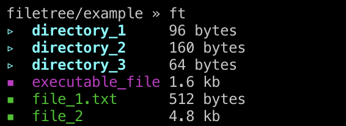
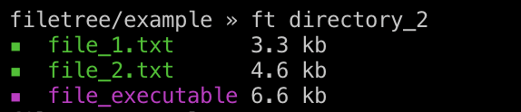

# the 'ft' command

ft.c is my own implementation of the 'ls' command written in C. in order to use it simply `git clone` this project wherever you'd like in your system and create an alias in your `.bashrc`/`.zshrc` that points to the `./ft` executable file:
```sh
alias ft='path/to/ft'
```

# Using 'ft'

When you write `ft` in the terminal (without any args), you should see an output that looks like this:


You can pass a directory path to `ft` in order to output the files in that directory as follows:


TODO:
 - add 'ls -a' functionality where dotfiles are shown as well.
